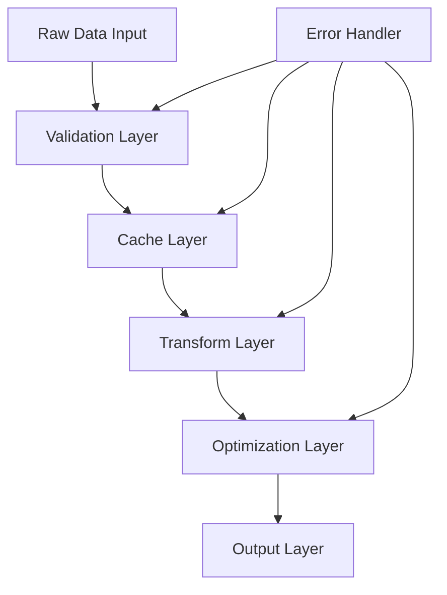

# Data Transformation Engine (Data Explorer Component)

[](https://www.npmjs.com/package/data-transformation-engine)
[](https://www.npmjs.com/package/data-transformation-engine)
[](https://opensource.org/licenses/MIT)

## Overview
The Data Explorer is a high-performance Vue component designed to handle and visualize large hierarchical datasets with an emphasis on categorical and temporal data. It implements an efficient data transformation engine with robust error handling and optimized rendering.

## 📦 Installation

```bash
npm install data-transformation-engine
```

### Requirements
- Node.js >= 14.0.0
- npm >= 7.0.0

## Data Engine Implementation Guide • Table of Contents

1. [Engine Architecture](#engine-architecture)
2. [Implementation Details](#implementation-details)
3. [Data Flow Steps](#data-flow-steps)
4. [Optimization Techniques](#optimization-techniques)
5. [Error Handling](#error-handling)
6. [Usage Patterns](#usage-patterns)

## Engine Architecture

### High-Level Overview



### Core Components

1. **Validation Layer**
   - Input validation
   - Type checking
   - Structure verification
   - Format validation

2. **Cache Layer**
   - Memory cache
   - Cache invalidation
   - Cache hit/miss tracking

3. **Transform Layer**
   - Data normalization
   - Structure optimization
   - Data merging
   - Category processing

4. **Optimization Layer**
   - Memory optimization
   - Performance tuning
   - Data structure optimization

5. **Output Layer**
   - Result formatting
   - Error wrapping
   - Data serialization

## Implementation Details

```javascript
const createDataEngine = () => {
  // Private cache storage
  const cache = new Map();
  
  // Private validators
  const validators = {
    isValidTerm: (term) => typeof term === 'string' && term.length > 0,
    isValidStream: (stream) => typeof stream === 'string' && stream.length > 0,
    isValidDetailed: (detailed) => Array.isArray(detailed) && detailed.length > 0,
    isValidMonth: (month) => /^\d{4}-\d{2}$/.test(month),
    isValidValue: (value) => !isNaN(value),
    isValidStructure: (data) => {
      return data && 
             Array.isArray(data) && 
             data.every(item => 
               item.term && 
               Array.isArray(item.interval) &&
               Array.isArray(item.info)
             );
    }
  };

  // Private transformers
  const transformers = {
    // Merge detailed data
    mergeDetailed: (existing, incoming) => {
      const uniqueMap = new Map();
      
      // Process existing data
      existing.forEach(item => {
        const key = `${item.month}-${item.branch}`;
        uniqueMap.set(key, item);
      });
      
      // Merge incoming data
      incoming.forEach(item => {
        const key = `${item.month}-${item.branch}`;
        if (!uniqueMap.has(key) || new Date(item.month) > new Date(uniqueMap.get(key).month)) {
          uniqueMap.set(key, item);
        }
      });
      
      return Array.from(uniqueMap.values());
    },

    // Calculate aggregates
    calculateAggregates: (detailed) => {
      return detailed.reduce((acc, curr) => {
        const value = Number(curr.value);
        return {
          total: acc.total + value,
          branches: new Set([...acc.branches, curr.branch]),
          months: new Set([...acc.months, curr.month])
        };
      }, { total: 0, branches: new Set(), months: new Set() });
    },

    // Normalize data structure
    normalizeData: (data) => {
      return data.map(item => ({
        ...item,
        value: item.value ? Number(item.value) : 0,
        month: item.month.trim(),
        branch: item.branch.trim()
      }));
    }
  };

  // Cache management
  const cacheManager = {
    get: (key) => cache.get(key),
    set: (key, value) => cache.set(key, value),
    has: (key) => cache.has(key),
    delete: (key) => cache.delete(key),
    clear: () => cache.clear(),
    generateKey: (data) => JSON.stringify(data)
  };

  // Error handling
  const errorHandler = {
    wrap: (fn, errorMessage) => {
      try {
        return fn();
      } catch (error) {
        console.error(`${errorMessage}:`, error);
        throw error;
      }
    },
    validate: (data, validator, errorMessage) => {
      if (!validator(data)) {
        throw new Error(errorMessage);
      }
    }
  };

  // Main processing pipeline
  const processRawData = (data) => {
    return errorHandler.wrap(() => {
      // 1. Input Validation
      errorHandler.validate(
        data,
        validators.isValidStructure,
        'Invalid data structure'
      );

      // 2. Cache Check
      const cacheKey = cacheManager.generateKey(data);
      if (cacheManager.has(cacheKey)) {
        return cacheManager.get(cacheKey);
      }

      // 3. Data Processing
      const termMap = new Map();
      
      data.forEach(item => {
        // Validate term
        errorHandler.validate(
          item.term,
          validators.isValidTerm,
          `Invalid term: ${item.term}`
        );

        // Initialize or get term data
        if (!termMap.has(item.term)) {
          termMap.set(item.term, {
            id: crypto.randomUUID(),
            term: item.term,
            info: new Map()
          });
        }

        const termData = termMap.get(item.term);
        
        // Process info items
        item.info.forEach(info => {
          // Validate stream
          errorHandler.validate(
            info.stream,
            validators.isValidStream,
            `Invalid stream: ${info.stream}`
          );

          // Validate detailed data
          errorHandler.validate(
            info.detailed,
            validators.isValidDetailed,
            `Invalid detailed data for stream: ${info.stream}`
          );

          // Process existing or new info
          const existingInfo = termData.info.get(info.stream);
          if (existingInfo) {
            // Merge with existing data
            existingInfo.detailed = transformers.mergeDetailed(
              existingInfo.detailed,
              info.detailed
            );
            
            // Update aggregates
            const aggregates = transformers.calculateAggregates(existingInfo.detailed);
            existingInfo.value = aggregates.total;
            existingInfo.uniqueBranches = aggregates.branches.size;
            existingInfo.monthRange = {
              start: Math.min(...aggregates.months),
              end: Math.max(...aggregates.months)
            };
          } else {
            // Create new info entry
            const normalizedDetailed = transformers.normalizeData(info.detailed);
            const aggregates = transformers.calculateAggregates(normalizedDetailed);
            
            termData.info.set(info.stream, {
              ...info,
              detailed: normalizedDetailed,
              uniqueBranches: aggregates.branches.size,
              monthRange: {
                start: Math.min(...aggregates.months),
                end: Math.max(...aggregates.months)
              }
            });
          }
        });
      });

      // 4. Transform to final structure
      const processed = Array.from(termMap.values()).map(item => ({
        ...item,
        info: Array.from(item.info.values()).map(info => ({
          ...info,
          detailed: info.detailed.sort((a, b) => b.month.localeCompare(a.month))
        }))
      }));

      // 5. Cache result
      cacheManager.set(cacheKey, processed);

      return processed;
    }, 'Error processing raw data');
  };

  // Public API
  return {
    processRawData,
    clearCache: cacheManager.clear,
    validators,
    transformers
  };
};
```

## Data Flow Steps

### 1. Input Validation Layer

```javascript
// Step 1: Structure Validation
errorHandler.validate(
  data,
  validators.isValidStructure,
  'Invalid data structure'
);

// Step 2: Term Validation
errorHandler.validate(
  item.term,
  validators.isValidTerm,
  `Invalid term: ${item.term}`
);

// Step 3: Stream Validation
errorHandler.validate(
  info.stream,
  validators.isValidStream,
  `Invalid stream: ${info.stream}`
);

// Step 4: Detailed Data Validation
errorHandler.validate(
  info.detailed,
  validators.isValidDetailed,
  `Invalid detailed data for stream: ${info.stream}`
);
```

### 2. Cache Management Layer

```javascript
// Step 1: Generate Cache Key
const cacheKey = cacheManager.generateKey(data);

// Step 2: Check Cache
if (cacheManager.has(cacheKey)) {
  return cacheManager.get(cacheKey);
}

// Step 3: Process Data
const processed = processData(data);

// Step 4: Store in Cache
cacheManager.set(cacheKey, processed);
```

### 3. Data Transformation Layer

```javascript
// Step 1: Initialize Data Structure
const termMap = new Map();

// Step 2: Process Terms
termMap.set(item.term, {
  id: crypto.randomUUID(),
  term: item.term,
  info: new Map()
});

// Step 3: Process Info Items
const existingInfo = termData.info.get(info.stream);
if (existingInfo) {
  // Merge with existing data
  mergeData(existingInfo, info);
} else {
  // Create new entry
  createNewEntry(info);
}

// Step 4: Calculate Aggregates
const aggregates = transformers.calculateAggregates(detailed);

// Step 5: Normalize and Sort
const normalized = transformers.normalizeData(detailed);
const sorted = normalized.sort((a, b) => b.month.localeCompare(a.month));
```

## Optimization Techniques

### 1. Memory Optimization

```javascript
// Use Map for O(1) lookups
const termMap = new Map();

// Use Set for unique values
const uniqueBranches = new Set();

// Efficient data merging
const mergeDetailed = (existing, incoming) => {
  const uniqueMap = new Map();
  // ... merging logic
};
```

### 2. Performance Optimization

```javascript
// Cache expensive operations
const cacheKey = JSON.stringify(data);
if (cache.has(cacheKey)) return cache.get(cacheKey);

// Efficient data structure
const termData = {
  id: crypto.randomUUID(),
  term: item.term,
  info: new Map()  // O(1) lookup
};

// Optimize sorting
detailed.sort((a, b) => b.month.localeCompare(a.month));
```

### 3. Memory Management

```javascript
// Clear cache when needed
const clearCache = () => cache.clear();

// Remove unused data
const cleanup = () => {
  cache.forEach((value, key) => {
    if (isStale(value)) cache.delete(key);
  });
};
```

## Error Handling

### 1. Validation Errors

```javascript
const validators = {
  isValidTerm: (term) => {
    if (!term || typeof term !== 'string') {
      throw new Error('Invalid term type');
    }
    if (term.length === 0) {
      throw new Error('Term cannot be empty');
    }
    return true;
  }
};
```

### 2. Processing Errors

```javascript
const processWithErrorHandling = (data) => {
  try {
    return processRawData(data);
  } catch (error) {
    console.error('Processing error:', error);
    return {
      error: true,
      message: error.message,
      data: null
    };
  }
};
```

### 3. Cache Errors

```javascript
const safeCacheAccess = (key) => {
  try {
    return cache.get(key);
  } catch (error) {
    console.error('Cache access error:', error);
    cache.delete(key);  // Clean up potentially corrupted cache
    return null;
  }
};
```

## Usage Patterns

### 1. Basic Usage

```javascript
const engine = createDataEngine();
const processed = engine.processRawData(rawData);
```

### 2. With Error Handling

```javascript
const engine = createDataEngine();
try {
  const processed = engine.processRawData(rawData);
  // Use processed data
} catch (error) {
  console.error('Engine error:', error);
  // Handle error case
}
```

### 3. With Cache Management

```javascript
const engine = createDataEngine();

// Process data
const result1 = engine.processRawData(data);

// Same data will use cache
const result2 = engine.processRawData(data);

// Clear cache if needed
engine.clearCache();
```

### 4. Custom Validation

```javascript
const engine = createDataEngine();
const customValidator = (data) => {
  return engine.validators.isValidStructure(data) &&
         engine.validators.isValidTerm(data.term);
};

if (customValidator(data)) {
  const processed = engine.processRawData(data);
}
```

## Performance Considerations

1. **Memory Usage**
   - Use Map and Set for efficient data structures
   - Implement cache size limits
   - Clean up unused data

2. **Processing Speed**
   - Optimize loops and iterations
   - Use efficient sorting algorithms
   - Implement lazy loading where possible

3. **Cache Efficiency**
   - Implement cache invalidation strategy
   - Monitor cache hit/miss ratio
   - Optimize cache key generation

## Best Practices

1. **Data Validation**
   - Always validate input data
   - Use type checking
   - Validate data structure
   - Handle edge cases

2. **Error Handling**
   - Implement comprehensive error handling
   - Provide meaningful error messages
   - Log errors appropriately
   - Recover gracefully from errors

3. **Code Organization**
   - Keep code modular
   - Use consistent naming
   - Document complex logic
   - Follow SOLID principles

4. **Testing**
   - Unit test all components
   - Test edge cases
   - Performance testing
   - Memory leak testing

## Contributing Guidelines

1. Follow the established code style
2. Add tests for new functionality
3. Update documentation
4. Consider performance implications
5. Test edge cases thoroughly

## License

MIT License - See LICENSE file for details
